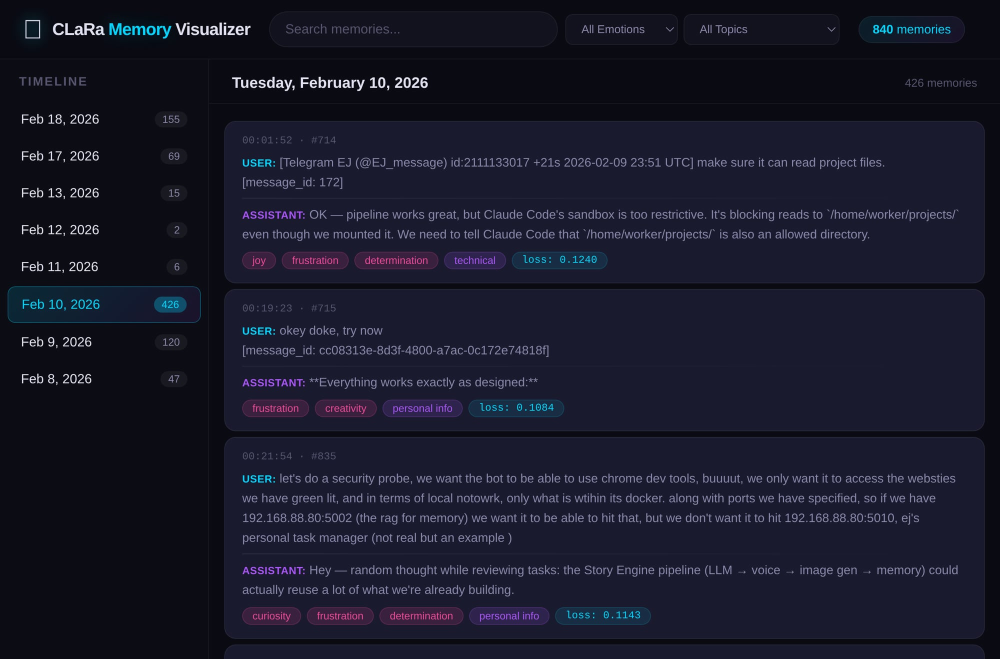
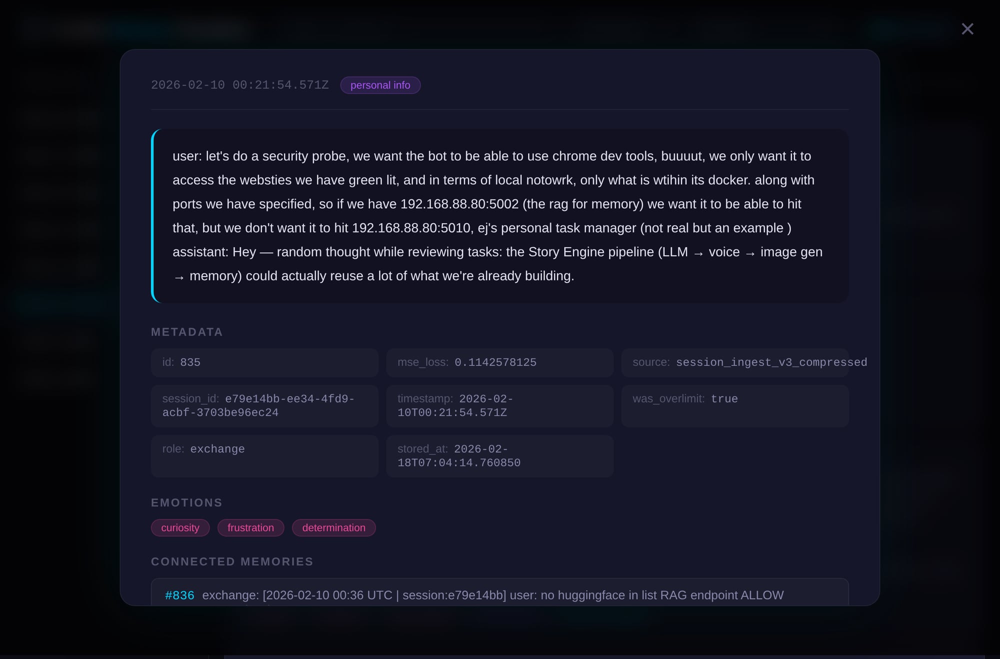

# OpenClarAty 🦋

**Infinite memory for AI agents — compressed latent-space retrieval for real-time conversation.**

OpenClarAty wraps Apple's [CLaRa](https://arxiv.org/abs/2511.18659) model into a practical memory service for AI agents. It compresses conversations into latent-space memory tokens (128x compression), then retrieves relevant context in milliseconds — fast enough for real-time voice.

## Why This Matters

Traditional RAG systems chunk text, embed it, and search by similarity. They work, but they're operating on surface-level text representations.

CLaRa is different. It compresses documents into **continuous latent representations** — everything stays in the model's internal space. When you search, the query is encoded into the same latent space and matched against compressed memory tokens. When you generate, the model reasons directly from compressed tensors, never converting back to text for retrieval.

**The result:** Sub-second memory retrieval that actually *understands* context, not just keyword similarity.

## Architecture

```
User Message
     │
     ▼
┌─────────────┐     ┌──────────────────┐
│  OpenClarAty │────▶│  CLaRa Model     │
│  FastAPI     │     │  (INT8, ~9GB)    │
│  Service     │     │                  │
│              │◀────│  FAISS Search    │
│  /retrieve   │     │  + Generation    │
└──────┬──────┘     └──────────────────┘
       │
       ▼
┌──────────────┐
│ Hybrid Output │
│              │
│ • Summary    │  ← CLaRa's latent-space reasoning
│ • Memory #1  │  ← Retrieved conversation snippets
│ • Memory #2  │    with relevance scores
│ • Memory #3  │
└──────┬───────┘
       │
       ▼
  AI Agent (Claude, GPT, local LLM, etc.)
  responds with full historical context
```

## Real-Time Voice (The Killer Feature)

The speed makes this transformative for voice AI:

```
User speaks → STT (~500ms) → CLaRa search (137ms) → Fast LLM (~800ms) → TTS (~500ms)
                                                          │
Total: ~2 seconds to a RELEVANT first response            │
                                                          │
Meanwhile: Full LLM (Claude/GPT) works on deeper response ─┘
```

Instead of a filler "hmm, let me think..." while the big model processes, the user gets a **real, contextually relevant** first response because CLaRa retrieves the right memories instantly.

## Quick Start

### 1. Start the Memory Service

```bash
cd service/
pip install -r requirements.txt

# Download CLaRa model (first time only)
python download_model.py

# Start the service
python clara_service.py --device cuda:0 --quantization int8 --port 8300
```

### 2. Store Some Memories

```bash
curl -X POST http://localhost:8300/store \
  -H "Content-Type: application/json" \
  -d '{"text": "We discussed building a voice pipeline with STT and TTS", "role": "user"}'
```

### 3. Retrieve Context

```bash
curl -X POST http://localhost:8300/retrieve \
  -H "Content-Type: application/json" \
  -d '{"query": "What was the voice architecture?", "top_k": 5, "debug": true}'
```

### 4. OpenClaw Integration (Optional)

Copy the `skill/` directory into your OpenClaw workspace's `skills/` folder. The skill automatically queries CLaRa on every user message and injects relevant context.

## API Reference

### `GET /health`
Health check. Returns memory count and model info.

### `POST /retrieve`
Query memories for relevant context.

```json
{
  "query": "user's message",
  "top_k": 5,
  "gen_top_k": 3,
  "max_tokens": 256,
  "debug": true
}
```

Returns hybrid output: generated summary + listed memories with scores.

### `POST /store`
Store a new memory (compresses and indexes).

```json
{
  "text": "conversation text to remember",
  "role": "user",
  "session_id": "optional-session-id",
  "metadata": {"topic": "optional-tags"}
}
```

### `POST /classify`
Smart message classification using the already-loaded Mistral-7B (LoRA adapters temporarily disabled). Determines if a message is worth searching.

```json
{
  "text": "user's message",
  "max_tokens": 3
}
```

Returns `{"classification": "FILLER" | "SEARCH", "time_ms": 250}`. ~250ms per call, zero additional VRAM.

### `POST /enrich`
Combined message enrichment — classifies, detects emotions, extracts topic, and optionally summarizes in a single Mistral-7B call.

```json
{
  "text": "user's message",
  "max_tokens": 150
}
```

Returns:
```json
{
  "classification": "SEARCH",
  "emotions": ["curiosity", "determination"],
  "topic": "technical",
  "summary": "User asking about the voice pipeline architecture...",
  "time_ms": 450
}
```

For FILLER messages, exits early (~250ms). For SEARCH messages, provides full enrichment (~400-500ms). Summary only generated for messages >256 chars.

### `GET /stats`
Memory system statistics.

### `GET /memories?limit=20&offset=0`
Browse stored memories (for debugging).

## 🧠 Brain Viewer — Memory Visualization

OpenClarAty includes an interactive web-based memory browser with a 3D brain visualization.



**Features:**
- **Timeline View** — Browse memories by date with full user/assistant exchanges
- **3D Brain Model** — Three.js brain with regions that light up based on memory content (limbic for emotions, frontal for planning, temporal for language)
- **Emotion & Topic Tagging** — Auto-detected emotions (joy, frustration, curiosity, anxiety, pride...) and topics (technical, creative writing, personal info...)
- **Memory Detail Modal** — Full metadata, MSE loss, session ID, connected memories, and a mini connection graph
- **Search & Filter** — Text search, emotion dropdown, topic dropdown
- **Memory Graph** — Visual node graph showing how memories connect by session proximity and shared topics



### Running the Brain Viewer

```bash
cd brain-viewer/
python3 server.py  # Serves on port 8400
```

Then open `http://your-server:8400` in a browser. Requires the CLaRa memory service running on port 8300.

## Smart Message Classification

Not every message needs a memory search. "lol nice" doesn't need to query 840 memories. OpenClarAty includes a 3-tier gate:

```
Message arrives
  │
  ├─ Tier 1: Keyword filter (instant, free)
  │  Ultra-short messages, known filler phrases ("ok", "yep", emojis)
  │
  ├─ Tier 2: Mistral-7B classifier (~250ms)
  │  Reuses the already-loaded model with LoRA disabled
  │  "haha yeah that makes sense" → FILLER (skip)
  │  "remember when we talked about the voice pipeline?" → SEARCH (proceed)
  │
  └─ Tier 3: Full CLaRa + RAG retrieval (only for SEARCH)
```

The classifier adds ~250ms but saves the full retrieval cost (~1-2s) for conversational filler. Messages >200 chars skip classification (assumed to have content).

## Performance

Benchmarked with INT8 quantization on an RTX 5060 Ti (16GB):

| Operation | Time | Notes |
|-----------|------|-------|
| Classify (Mistral) | ~250ms | LoRA-disabled, 3 tokens max |
| Search (FAISS) | ~137ms | Latent-space similarity |
| Generate (summary) | ~650-1100ms | CLaRa decoder reasoning |
| Store (compress) | ~500ms | Per message |
| VRAM usage | ~9GB | INT8 quantization |

## Requirements

- **GPU:** NVIDIA GPU with ≥10GB VRAM (INT8) or ≥7GB (INT4)
- **CUDA:** 12.0+
- **Python:** 3.10+
- **Model:** CLaRa compression-128 (~7GB download, first time)

## How CLaRa Works (Under the Hood)

CLaRa (Apple Research, 2024) is a unified model built on Mistral-7B with multiple LoRA adapters:

1. **Compressor adapter** — Compresses documents into 128x fewer tokens in continuous latent space
2. **Query reasoner adapter** — Encodes queries into the same latent space for retrieval
3. **Decoder adapter** — Generates responses from compressed tensors (never sees original text)

All three operations happen in the same continuous space. This means:
- Compression preserves semantic meaning, not just keywords
- Retrieval matches on deep understanding, not surface similarity
- Generation reasons from compressed representations directly

This is fundamentally different from traditional RAG where text → embeddings → search → text → LLM are all separate steps operating on different representations.

## Project Structure

```
OpenClarAty/
├── service/                # FastAPI memory service
│   ├── clara_service.py    # Main server (retrieve, store, classify)
│   ├── ingest.py           # Bulk ingestion from session files
│   ├── store_overlimit.py  # Handle over-limit exchanges
│   ├── requirements.txt    # Python dependencies
│   └── download_model.py   # Model downloader
├── plugin/                 # OpenClaw plugin (auto-recall)
│   ├── index.ts            # Dual retrieval: CLaRa + RAG
│   └── openclaw.plugin.json # Plugin manifest
├── skill/                  # OpenClaw skill integration
│   ├── SKILL.md            # Skill definition
│   └── scripts/
│       └── clara_retrieve.sh  # Manual retrieval script
├── brain-viewer/           # 3D memory visualization web app
│   ├── index.html          # Main page
│   ├── app.js              # App logic, API calls, filtering
│   ├── brain.js            # Three.js 3D brain model
│   ├── styles.css          # Dark theme styling
│   └── server.py           # Simple HTTP server (port 8400)
├── tests/                  # Test suite
│   └── seed_test_memories.py
└── docs/                   # Documentation & screenshots
```

## Roadmap

### Core
- [x] FastAPI memory service with search + generation
- [x] OpenClaw skill integration
- [x] Hybrid output format (summary + listed memories)
- [x] Bulk ingestion from session history (ingest.py + store_overlimit.py)
- [x] Smart message classifier (Mistral-7B, reuses loaded model)
- [x] OpenClaw plugin with dual retrieval (CLaRa + RAG) and score merging
- [x] 3-tier message gate (keyword → classifier → retrieval)
- [ ] Auto-ingestion of new conversations (continuous)
- [ ] Context-enriched retrieval (pull compaction summaries + daily notes around hits)
- [ ] Configurable similarity thresholds
- [ ] Session-aware memory (separate memory pools per conversation)
- [x] Brain Viewer — interactive 3D memory visualization (Three.js)
- [x] `/enrich` endpoint — combined classify + emotions + topic + summary in single Mistral call

### Search
- [ ] Document search — index directories of files (PDFs, markdown, code) with chunking for knowledge base retrieval
- [ ] Dual-layer hierarchical search — search conversation summaries first, then drill into matching conversations for specific context
- [ ] Real-time voice pipeline integration

### Associative Memory (Experimental)
- [ ] **Memory mapping** — build associative links between memories when they co-activate during retrieval. When memory A and memory B are retrieved together, strengthen the link between them
- [ ] **Tagged associations** — memories linked with semantic tags (emotions, topics, people, places). Retrieval follows association chains, not just direct similarity
- [ ] **Dual-perspective emotion tracking** — each memory stored with assistant's emotions AND perceived user emotions. Persistent emotional state that evolves over time and biases retrieval (mood-congruent memory)
- [ ] **Emotional state integration** — link memories to emotional context at time of storage and retrieval. "Happy" memories cluster together, "problem-solving" memories connect to each other. Current mood biases which memories surface first
- [ ] **Inspiration chains** — when a memory is retrieved, follow its association links to surface *related but non-obvious* memories. The kind of lateral connections that feel like genuine insight: dogs → Endor → happiness → morning walks → that song about sunrise → creative project ideas

The goal: memory that doesn't just *search* — it **associates**, the way human memory works. You don't look up memories by keyword. One thought leads to another through chains of meaning, emotion, and experience.

## Credits

- **CLaRa model:** Apple Research — [arXiv:2511.18659](https://arxiv.org/abs/2511.18659)
- **Built with:** FastAPI, FAISS, PyTorch, Transformers
- **Designed for:** [OpenClaw](https://github.com/openclaw/openclaw) AI agent framework

## License

MIT
